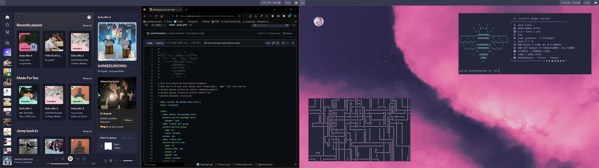

# YOURFRIEND'S DOTFILES

pipes.sh -c 5 -p 2 -f 1 -s 2

1. [Get archlinux into a bootable/usable state instantly](install-arch.md)
2. [Get archlinux into a full desktop](apps.md)

## Credit
1. [Catppuccin Macchiato - contributors](https://github.com/catppuccin/catppuccin)
2. [Managing my dotfiles with GNU Stow - Wesley Schwengle](https://medium.com/@waterkip/managing-my-dotfiles-with-gnu-stow-262d2540a866)
3. [Pink cloud wallpaper - JV Buenconcejo](https://www.pexels.com/@jvbuenconcejo/)